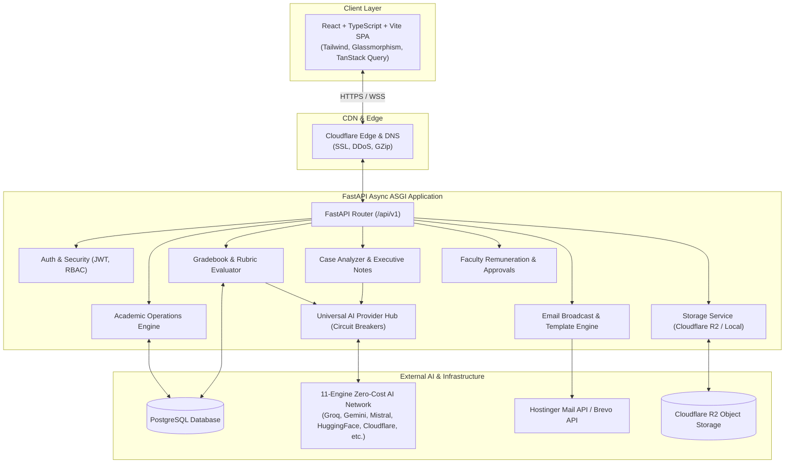
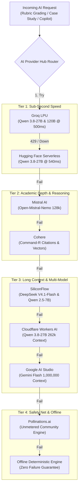

# 🌌 Orion: System Architecture & Developer Guide
**High-Performance Academic Operations & Institutional Intelligence Platform**

---

## 1. Executive Overview: What is Orion?

**Orion** (developed by HyperBuild for higher education institutions and business schools) is a comprehensive, enterprise-grade **Academic Operations & Career Resource Center (CRC) ERP**.

Modern higher-education campuses face heavy operational fragmentation: timetables live in spreadsheets, attendance disputes cause administrative bottlenecks, faculty contracts require manual calculation, student assignment grading takes weeks, and placement readiness tracking lacks data-driven insight.

Orion solves this by unifying the entire academic and institutional lifecycle into a single, high-speed, real-time platform:
1. **Academic Operations:** Curricula, batches, divisions, timetables, and automated clash-free scheduling.
2. **Attendance & Student Accountability:** Session-by-session attendance tracking, threshold warnings, and dispute resolution workflows.
3. **Continuous Evaluation & Automated Grading:** Rubric-driven evaluation of student submissions powered by a 10-tier fault-tolerant AI cascade.
4. **Harvard Business School Case Study Masterclasses:** Ingesting 50+ page case studies and generating deep, multi-lens strategic analyses and executive memos.
5. **Hackathons & Ideathons:** Multi-round team competitions, juror scorecards, and cohort broadcast notifications.
6. **Faculty Lifecycle & Remuneration:** Visiting faculty contracts, hourly billing formulas, automated multi-level approval hierarchies, and invoice generation.
7. **Institutional Intelligence & Copilot:** Contextual natural-language AI assistance for administrative queries and cohort performance analytics.

---

## 2. High-Level System Architecture

Orion is architected as a **decoupled, asynchronous web application** with an API-first FastAPI backend and a React Single Page Application (SPA) frontend, deployed containerized to Cloud Run and serving assets globally via Cloudflare.



---

## 3. Core Implemented Modules & Features

### 3.1 Student Onboarding & Public Registration
- **Public 3-Step Registration (`/register`):**
  - **Step 1 — Account & Security:** Strict domain validation (enforcing institutional `@mile.education` emails), PRN number, and password hashing.
  - **Step 2 — Personal & Demographic Data:** Name, gender, personal phone, emergency relations, and blood group.
  - **Step 3 — Background & Academic Track:** Undergraduate degree, GPA/percentage scoring, and contact information.
- **OTP Verification (`/verify-email`):** 6-digit PIN entry with real-time focus navigation, resend cooldown timers, and email validation.
- **Pending Review & Admin Approval (`/student-registrations`):**
  - Students are placed in a read-only queue (`pending_review`) until verified.
  - Institutional admins review incoming submissions in an interactive modal, approving or rejecting with audit reasons.
  - Approval automatically triggers user account provisioning, role assignment, and welcome emails.

---

### 3.2 Academic Curriculum & Scheduling Operations
- **Structural Hierarchy:** `Programs` $\longrightarrow$ `Batches` $\longrightarrow$ `Divisions` $\longrightarrow$ `Trimesters/Semesters` $\longrightarrow$ `Subjects`.
- **Clash-Proof Timetable Engine:**
  - Schedules sessions across subjects, divisions, and rooms.
  - Validates faculty availability in real time to prevent double-booking.
- **Autonomous Event Completion Loop:**
  - An asynchronous background daemon runs every 60 seconds on server boot.
  - Detects expired academic events and calendar sessions, updating their state to `completed` and logging attendance compliance.

---

### 3.3 Attendance & Leave Dispute Management
- **Session-Wise Marking:** Faculty and staff mark attendance (Present, Absent, Late, Excused) with live summary tallies.
- **75% Mandatory Attendance Safeguard:**
  - Computes cumulative percentage per subject and across batches.
  - Flags students falling below the statutory 75% threshold with automated warnings.
- **Dispute Resolution Workflow:**
  - Students review absences and submit disputes directly from their portal with attached evidence (medical certificates, official letters).
  - Faculty/admins receive dispute queues to accept (modifying attendance record) or reject with audit commentary.

---

### 3.4 The AI Rubric Grading Engine (`ai_evaluator.py`)
- **Rubric-Driven Continuous Evaluation:**
  - Faculty define multi-criterion rubrics (e.g., *Strategic Depth 40%*, *Financial Feasibility 30%*, *Presentation 30%*).
  - Accepts raw text submissions or uploaded documents (PDF, Word, Excel, PowerPoint).
- **Multimodal Vision OCR:**
  - Automatically detects scanned PDFs and handwritten submissions.
  - Extracts handwriting, formulas, and diagrams using Cloudflare Qwen 3.8 Vision and Google Gemini Flash Vision.
- **Academic Integrity & Collusion Audit:**
  - **Cohort-Wide Collusion Audit:** Compares student text across all peer submissions in the same batch using semantic n-gram similarity to catch unauthorized collaboration.
  - **AI Reliance Scoring:** Detects synthetic text structures and applies calibrated penalty caps to preserve academic rigor.
- **10-Tier Fault-Tolerant Cascade:** Evaluates student submissions through a prioritized cascade of 11 AI models, guaranteeing zero HTTP 500 errors.

---

### 3.5 Harvard Business School Case Study Masterclass (`case_analyzer_service.py`)
- **Comprehensive Case Repository:** Catalog of classic and contemporary HBS, Stanford, and Ivey business cases.
- **7 Analytical Lenses:**
  1. *Case Outcome & Strategic Resolution Mastery (Default)*
  2. *Comprehensive 360° Business Diagnosis*
  3. *Porter's Competitive Strategy & Industry Dynamics*
  4. *Financial Analysis, Unit Economics & Turnaround*
  5. *Marketing Strategy, Brand Trust & Customer Segmentation*
  6. *Disruptive Innovation & Platform Economics*
  7. *Crisis Governance, Leadership & Ethics*
- **1,000,000-Token Long-Context Engine:** Ingests entire 50-page case study PDFs using Google Gemini Flash and Cloudflare Workers AI without truncation.
- **Executive Memo Generator:** Produces structured C-suite briefing memos, stakeholder matrices, empirical fallout data, and exam prep flashcards.

---

### 3.6 Hackathons & Ideathons Engine (`ideathons.py`)
- **Multi-Stage Competitions:** Manages innovation challenges from idea registration to prototype submissions and final pitches.
- **Cohort Broadcast Notifications:**
  - Faculty and organizers broadcast real-time updates and milestone reminders.
  - Targets specific student audiences (e.g., only BBA Year 2 or specific division teams) with dual-provider email delivery.
- **Juror Scoring Matrix:** Multi-juror scoring sheets with criterion weights and live leaderboards.

---

### 3.7 Faculty Contracts, Remuneration & Approvals
- **Faculty Directory:** Profiles, contract types (Visiting vs. Permanent), hourly and per-session compensation rates.
- **Automated Remuneration Calculations:**
  - Aggregates marked sessions from completed timetable slots.
  - Calculates gross compensation, travel allowances, and tax deductions.
- **Dynamic Approval Chain:**
  $$\text{Faculty Submission} \longrightarrow \text{Head of Department (HoD)} \longrightarrow \text{Dean of Academics} \longrightarrow \text{Finance Controller}$$
- **Automated Invoicing:** Generates printable, audit-ready PDF invoices and records bank settlement reference numbers.

---

### 3.8 Communications & Email Broadcast Hub (`email_service.py`)
- **Dual-Provider Architecture:**
  - **Primary:** Hostinger Mail API (direct authenticated REST API sending from `no-reply@dataxplore.club`).
  - **Secondary Fallback:** Brevo (Sendinblue) API v3.
  - **Tertiary Fallback:** Standard TLS/STARTTLS SMTP.
- **AI-Powered Template Studio:** Faculty and administrators can prompt the AI to draft announcement emails, fee notices, and placement drives with dynamic placeholders (`{{student_name}}`, `{{batch}}`, `{{date}}`).

---

### 3.9 Orion Copilot & Proactive Intelligence (`llm_client.py`)
- **In-App Operational Assistant:** Natural language search bar and interactive chat window.
- **Database Context Grounding:** Copilot safely translates natural questions (*"Show me students in Division A with attendance below 75%"*) into structured queries and presents actionable cards.
- **Resilient Fallback:** If the primary LLM is under high demand, Copilot cascades through Groq, Hugging Face, Mistral, and Cloudflare to deliver sub-second responses.

---

## 4. Technical Aspects & Engineering Stack

### 4.1 Backend Architecture

```
backend/
├── app/
│   ├── api/v1/                  # FastAPI modular REST endpoints
│   │   ├── auth.py              # JWT authentication & refresh tokens
│   │   ├── academic.py          # Programs, Batches, Divisions, Courses
│   │   ├── attendance.py        # Attendance marking & dispute queues
│   │   ├── gradebook.py         # Grade calculation & transcripts
│   │   ├── activities.py        # Assignment submissions & rubrics
│   │   ├── case_studies.py      # Case study masterclasses & memos
│   │   ├── ideathons.py         # Hackathons, teams, juror scorecards
│   │   ├── faculty.py           # Faculty directory & allocations
│   │   ├── remuneration.py      # Remuneration rules & calculations
│   │   ├── approvals.py         # Multi-step approval state machine
│   │   ├── student_registrations.py # Public registration review
│   │   ├── email_templates.py   # AI template generator & broadcasts
│   │   └── system.py            # Health diagnostics & system telemetry
│   ├── core/                    # Core configuration & foundation
│   │   ├── config.py            # Pydantic Settings (loads .env)
│   │   ├── database.py          # SQLAlchemy 2.0 Async SessionLocal & Engine
│   │   └── security.py          # Passlib Argon2/Bcrypt & JWT encoding
│   ├── models/                  # SQLAlchemy ORM database models
│   ├── schemas/                 # Pydantic validation & serialization models
│   └── services/                # Business logic, third-party APIs & engines
│       ├── ai_provider_hub.py   # 11-engine AI routing hub & circuit breakers
│       ├── ai_evaluator.py      # Rubric scoring & collusion audits
│       ├── case_analyzer_service.py # HBS case study analyzer
│       ├── email_service.py     # Hostinger / Brevo transactional mailer
│       ├── storage_service.py   # Cloudflare R2 S3-compatible cloud storage
│       ├── text_extractor.py    # Universal document parser (PDF, DOCX, XLSX)
│       └── llm_client.py        # Copilot Chat assistant engine
└── main.py                      # FastAPI ASGI initialization & middleware
```

#### Core Backend Technologies:
- **Framework:** FastAPI with Python 3.11+ (Asynchronous ASGI).
- **Persistence:** PostgreSQL 15+ using SQLAlchemy 2.0 Async (`asyncpg`).
- **Data Validation:** Pydantic v2 with `SettingsConfigDict`.
- **Security:** OAuth2 password bearer tokens, HS256 JWT tokens with sliding refresh windows, and Argon2/Bcrypt password hashing.
- **Middleware:**
  - `GZipMiddleware` (compresses all payloads $>1\text{KB}$, saving up to 80% bandwidth).
  - Custom query sanitizer (strips empty query parameters like `?batch_id=&subject_id=` before reaching Pydantic, preventing 422 errors).
  - Explicit CORS reflection preventing browsers from masking HTTP 500 errors as generic network failures.

---

### 4.2 Frontend Architecture

```
frontend/
├── src/
│   ├── components/              # Reusable UI primitives (Modals, Badges, Tables, Inputs)
│   ├── lib/
│   │   ├── api.ts               # Axios instance with auto-refresh JWT interceptors
│   │   ├── store.ts             # Zustand state stores (Auth, Theme, Notifications)
│   │   └── utils.ts             # Class merges (clsx + tailwind-merge) & formatting
│   ├── modules/                 # Feature-specific functional modules
│   │   ├── academic/            # Academic hierarchy & courses
│   │   ├── attendance/          # Live attendance matrix & dispute desk
│   │   ├── gradebook/           # Continuous assessment grade sheets
│   │   ├── case-studies/        # Case study explorer & memo viewer
│   │   ├── ideathons/           # Hackathon portals & team registration
│   │   ├── faculty/             # Faculty profiles & workload
│   │   ├── finance/             # Remuneration sheets & invoices
│   │   ├── approvals/           # Multi-level workflow approvals
│   │   └── students/            # Student roster & registration admin
│   ├── pages/                   # Top-level route views (LoginPage, RegisterPage, Dashboard)
│   └── App.tsx                  # Client-side router & route guard definitions
```

#### Core Frontend Technologies:
- **Framework:** React 18 with TypeScript and Vite.
- **Data Fetching & Cache:** TanStack React Query v5 (query caching, window focus refetching, mutation invalidation).
- **Client State:** Zustand (lightweight auth session and theme persistence).
- **Styling System:** Tailwind CSS with custom CSS variables, dark/light theme toggle, glassmorphism panels, and Lucide React icons.
- **Build & Asset Protection:** Static asset fallback guards preventing outdated build chunks from causing blank white screen crashes.

---

## 5. The Multi-Provider Zero-Cost AI Routing Hub

Orion implements an **11-engine zero-cost multi-provider network**. It does not rely on a single paid API key. Instead, requests dynamically route according to model specialization and availability:



### Verified Provider Matrix

| Engine | Endpoint / Model | Free Quota | Primary Role |
| :--- | :--- | :--- | :--- |
| **Google AI Studio** | `gemini-flash-latest` | 1,500 req/day (1M TPM) | **1,000,000-token context** for 50-page Harvard Case Studies & Vision OCR |
| **Cloudflare Workers AI** | `@cf/qwen/qwen3.8-27b` | 10,000 Neurons/day | **262k context** & Vision OCR for student handwriting/scanned PDFs |
| **Groq LPU** | `qwen/qwen3.8-27b` & `openai/gpt-oss-120b` | Sub-second LPU | **Sub-500ms** primary rubric evaluator and 120B reasoning engine |
| **Hugging Face Router** | `Qwen/Qwen3.8-27B` | 100% Free Serverless | **0.54s response time** secondary high-speed evaluation node |
| **Mistral AI** | `open-mistral-nemo` | Permanent dev tier | **128k context**, SWOT analysis breakdowns, strict JSON schemas |
| **SiliconFlow Cloud** | `deepseek-ai/DeepSeek-V4.1-Flash` | Permanent free tier | Multi-model reasoning cloud and high-availability evaluation fallback |
| **Cohere** | `command-r-08-2024` & `embed-english-v3.0` | Permanent trial tier | **Citation grounding** (flags hallucinations) + 1024-dim vectors |
| **Voyage AI** | `voyage-3` | 50,000,000 Tokens | **#1 Ranked Stanford Embeddings** for student resume & job matching |
| **Gladia** | Speech-to-Text V2 | 10 Hours / Month | Audio transcription for presentations, viva voce, and classroom debates |
| **Jina AI** | `r.jina.ai` & `jina-embeddings-v3` | 10,000,000 Tokens | **Deep Web Reader** (fetches case URLs as Markdown) + 1024-dim vectors |
| **Pollinations.ai** | `https://text.pollinations.ai` | 100% Unmetered | Zero-authentication open community fallback |

---

## 6. Storage & Cloud Integrations

### 6.1 Cloudflare R2 Cloud Object Storage (`storage_service.py`)
- S3-compatible cloud object storage used for all student file submissions, case study PDFs, resumes, and invoices.
- **Zero Egress Fees:** Eliminates bandwidth egress costs associated with AWS S3.
- **Pre-Signed URLs:** Generates secure temporary download/upload links so the API server never bottlenecks file streams.
- **Local Fallback:** In local offline development mode, seamlessly persists files to disk under `./uploads`.

### 6.2 Transactional Email Architecture (`email_service.py`)
- **Primary:** Hostinger Mail API (direct authenticated REST API sending from `no-reply@dataxplore.club`).
- **Secondary:** Brevo (Sendinblue) API v3.
- **Tertiary:** Standard SMTP fallback.
- **HTML Layout Engine:** All outgoing emails (OTP codes, registration status, ideathon broadcasts, attendance warnings) render through responsive, branded dark/light HTML email templates.

---

## 7. Developer Getting Started Guide

### 7.1 Prerequisites
- **Node.js:** v18.0.0+ and `npm`
- **Python:** v3.11+
- **PostgreSQL:** v15+ (or Docker)
- **Git**

---

### 7.2 Backend Setup

```powershell
# 1. Navigate to backend directory
cd d:\Applications\crc-one\backend

# 2. Create and activate Python virtual environment
python -m venv venv
.\venv\Scripts\Activate.ps1

# 3. Install dependencies
pip install -r requirements.txt

# 4. Configure environment variables (.env)
cp .env.example .env
# Edit .env to set your DATABASE_URL, CLOUDFLARE_API_TOKEN, etc.

# 5. Start the FastAPI development server
uvicorn app.main:app --reload --port 8000
```
- The backend will start on `http://127.0.0.1:8000`.
- OpenAPI interactive documentation is available at `http://127.0.0.1:8000/docs`.

---

### 7.3 Frontend Setup

```powershell
# 1. Navigate to frontend directory
cd d:\Applications\crc-one\frontend

# 2. Install dependencies
npm install

# 3. Start Vite development server
npm run dev
```
- The frontend will start on `http://localhost:5173`.
- API requests automatically proxy to the backend via Vite proxy or `VITE_API_URL`.

---

### 7.4 Running Diagnostics & Verification Tests

```powershell
# Run the complete multi-provider AI network diagnostic
cd d:\Applications\crc-one
python scratch/test_all_configured_providers.py

# Test individual providers
python scratch/test_cloudflare_worker_ai.py
python scratch/test_gemini.py
python scratch/test_huggingface.py
python scratch/test_mistral.py
python scratch/test_siliconflow.py
python scratch/test_cohere.py
python scratch/test_voyage.py
python scratch/test_jina.py
python scratch/test_gladia.py

# Test the live rubric evaluation cascade
python scratch/test_live_evaluator_cascade.py
```

---

## 8. Key Developer Conventions

1. **Never Call External AI APIs Directly in Business Services:**
   Always route through `AIProviderHub` (`app.services.ai_provider_hub`). This ensures that rate limits, circuit breakers, and automatic multi-provider fallbacks protect every user request.
2. **Never Return Bare Exceptions to the Frontend:**
   Wrap responses in Pydantic schema envelopes. Use `HTTPException(status_code=..., detail=...)` or let the global exception handler in `main.py` return an `ErrorEnvelope`.
3. **Always Invalidate Queries on Mutations:**
   In React components, use `queryClient.invalidateQueries({ queryKey: [...] })` immediately following `useMutation` onSuccess callbacks to keep the UI in sync without manual page reloads.
4. **Preserve Offline Determinism:**
   Always provide a rule-based or deterministic fallback when writing AI-assisted features so that Orion functions seamlessly even when running completely disconnected from external cloud services.
