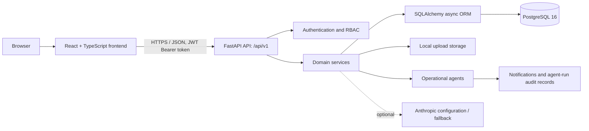

# Orion: Project Overview

## Purpose

Orion is a web-based **Academic Operations and Career Readiness management platform** for Lexicon MILE. It provides one operational workspace for all academic activities: programmes, batches, subjects and syllabi, students, faculty, delivery sessions, approvals, remuneration, invoices, feedback, and operational reporting.

The application is designed for several user groups—CRC administrators and coordinators, internal and external faculty, finance staff, approvers, reporting users, and students. Role-based access ensures that each group sees and can act on the areas relevant to its responsibilities.

## What the Product Does

### Academic management

- Maintains programmes, academic years, semesters, batches, divisions, subjects, and syllabus topics.
- Enrols students into batches and provides a student directory and self-service profile view.
- Supports subject archival, topic completion tracking, and subject-completion reports.
- Imports syllabus information from DOCX or PDF files and exports a subject syllabus as DOCX or PDF.

### Timetable, sessions, and attendance

- Creates and updates teaching sessions, including dates, times, venues, batches, subjects, and faculty assignments.
- Supports timetable upload and commit workflows, batch session edits, calendar views, and attendance capture.
- Checks proposed sessions for overlapping faculty or venue bookings and can suggest alternative slots.
- Validates that an external faculty member’s agreement remains valid for the intended session date.

### Faculty and engagement operations

- Maintains separate internal and external faculty records, including external-faculty agreements and supporting documents.
- Records external faculty engagements and calculates remuneration.
- Flags expiring faculty documents and can identify workload imbalance in the compliance automation layer.

### Finance and approvals

- Tracks remuneration calculations, invoices, and payments.
- Can create draft invoices and pending payments for approved external engagements.
- Supports invoice verification, including an amount-mismatch flag supplied by the invoice verification workflow, and payment release with a reference number.
- Provides staged approvals with SLA reminder and escalation support.

### Feedback, reporting, and oversight

- Marks sessions complete and creates a feedback form with a QR-code path and standard rating/comment questions.
- Stores feedback responses and a sentiment score.
- Provides remuneration, venue-utilisation, syllabus-completion, and operational audit reports, with CSV export.
- Provides global search, user notifications, an administrative audit trail, dashboard data, and admin system settings.

### Operational Copilot

- Includes an in-app natural-language query drawer for operational questions about sessions, faculty, and programmes/batches.
- Queries return structured records plus a summary and are logged as agent runs.
- The LLM client currently has a safe fallback when `ANTHROPIC_API_KEY` is not configured. Its provider integration is a scaffold: the present implementation returns a placeholder summary rather than calling an LLM API.

## Roles and Access

The backend uses JWT authentication and permissions, while the frontend also hides or protects routes by role. The defined roles are:

| Role | Typical responsibility |
| --- | --- |
| `crc_admin` | Full system administration and management |
| `crc_coordinator` | Academic, faculty, student, remuneration, and approval coordination |
| `faculty_internal` | Own teaching/faculty activities and relevant academic views |
| `faculty_external` | Own faculty activities, sessions, and invoice submission workflow |
| `finance` | Remuneration, invoices, payments, approvals, and reports |
| `approver` | Approval decisions and read-only operational access |
| `reporting_readonly` | Read-only reporting and operational views |
| `student` | Own profile and permitted academic, session, calendar, and feedback views |

## Technical Architecture



### Frontend

- **Framework:** React 18 with TypeScript and Vite.
- **UI:** Tailwind CSS, Lucide icons, dark/light theme support, and responsive application layout.
- **Routing:** React Router with public authentication routes and protected, role-aware application routes.
- **Client data:** Axios for API requests, TanStack Query for server-state caching, and Zustand for authentication/theme state.
- **Quality tooling:** TypeScript compilation, ESLint, and Vitest with React Testing Library.

### Backend

- **Framework:** FastAPI with Pydantic v2 request/response schemas and OpenAPI documentation.
- **API design:** Versioned REST API at `/api/v1`; consistent response envelopes; interactive API docs available at `/docs` when the service is running.
- **Data layer:** SQLAlchemy 2 async sessions with `asyncpg` for PostgreSQL. Alembic migration configuration and migrations are included.
- **Security:** Password hashing via `passlib`/bcrypt; JWT access and refresh tokens using `python-jose`; role and permission dependencies on API endpoints.
- **Files and documents:** `python-docx`, `pypdf`, and ReportLab support syllabus parsing and DOCX/PDF output. A configurable local directory stores uploaded files.
- **Email:** SMTP configuration is optional; development environments fall back to logging rather than sending email when SMTP is not configured.

### Data and domain model

The primary data areas are:

- Identity: users, roles, user registration and email verification.
- Academic: programmes, academic years, semesters, batches, divisions, subjects, and topics.
- People: students, internal faculty, external faculty, faculty documents, and student registrations.
- Delivery: sessions, attendance, timetable data, and faculty engagements.
- Finance: remuneration calculations, invoices, payments, and approval records/stages/actions.
- Intelligence and administration: feedback forms/responses, notifications, audit logs, system settings, and AI-agent run records.

### Automation modules

The backend contains domain agents that record their runs for traceability:

- **Scheduler Sentinel:** detects faculty and venue conflicts before sessions are created or updated.
- **Faculty Compliance Agent:** validates agreement dates and scans documents for approaching expiry.
- **Approval Watchdog:** creates SLA reminders and escalates overdue pending approval actions.
- **Invoice Sentinel:** drafts external-engagement invoices/payments and records invoice amount-verification results.
- **Feedback Intelligence Agent:** creates feedback forms after a session is completed and assigns sentiment scores to responses.
- **Operational Copilot Agent:** performs limited, schema-aware operational lookups and produces a summary.

The administrative API currently offers manual triggers for the Faculty Compliance Agent and Approval Watchdog. Scheduled execution should be configured separately if automated background runs are required.

## Repository Layout

```text
orion/
├── frontend/                 # React/Vite single-page application
│   └── src/
│       ├── components/       # Shared UI, layout, copilot drawer
│       ├── modules/          # Feature pages by domain
│       ├── pages/            # Authentication, dashboard, profile pages
│       └── lib/              # API client and client-side state
├── backend/                  # FastAPI service
│   ├── app/
│   │   ├── api/v1/           # REST endpoints
│   │   ├── agents/           # Operational automation modules
│   │   ├── core/             # Settings, database, security, permissions
│   │   ├── models/           # SQLAlchemy models
│   │   ├── schemas/          # Pydantic request/response models
│   │   └── services/         # Domain business logic
│   ├── migrations/           # Database migration scripts
│   └── tests/                # API, workflow, permissions, and agent tests
├── docker-compose.yml        # Local multi-service development environment
└── .env.example              # Environment-variable template
```

## Running the System

### Docker development environment

1. Copy `.env.example` to `.env` and set appropriate secrets and optional integrations.
2. Run `docker compose up --build` from the repository root.
3. Open the frontend at `http://localhost:5173` and the FastAPI docs at `http://localhost:8000/docs`.

Docker Compose starts:

- PostgreSQL 16 on port `5432`;
- FastAPI on port `8000`;
- the Vite frontend on port `5173`.

### Local development and checks

- Backend: install `backend/requirements.txt`, then run `uvicorn app.main:app --reload --reload-dir app` from `backend/`.
- Frontend: run `npm install` and `npm run dev` from `frontend/`.
- Backend tests: run `pytest` from `backend/`.
- Frontend tests: run `npm run test` from `frontend/`.
- Frontend production build: run `npm run build` from `frontend/`.

## Configuration and Operational Notes

| Setting | Purpose |
| --- | --- |
| `DATABASE_URL` | Async PostgreSQL connection string |
| `JWT_SECRET_KEY` | Secret used to sign access and refresh tokens; replace in every non-local deployment |
| `JWT_ACCESS_TOKEN_EXPIRE_MINUTES` | Access-token lifetime |
| `JWT_REFRESH_TOKEN_EXPIRE_DAYS` | Refresh-token lifetime |
| `ANTHROPIC_API_KEY` | Enables the configured LLM path; no key uses a fallback response |
| `CORS_ORIGINS` | Allowed browser origins |
| `FILE_STORAGE_PATH` | Local filesystem location for uploaded files |
| `SMTP_*` | Optional outbound email configuration |

Before production deployment, use a strong, unique JWT secret and database password, provide a restricted CORS allow-list, use persistent managed storage/backups, run migrations through a controlled process, and place the application behind HTTPS.

## API Areas

The versioned API includes endpoints for health, authentication, users, dashboard, academic data, students and registrations, sessions and timetables, faculty and engagements, remuneration, approvals, invoices, payments, calendar events, feedback, Copilot queries, reports, settings, search, notifications, and audits. The definitive endpoint contract is the generated OpenAPI specification at `/api/v1/openapi.json` (or the interactive `/docs` page) while the service is running.

## Current Development Status

The codebase includes Docker development support, automated backend test coverage across major workflows, and a built frontend bundle under `dist`/`public_html`. The local service also creates registered database tables at startup for development/testing; use the included Alembic migrations as the controlled schema-change mechanism in production.
